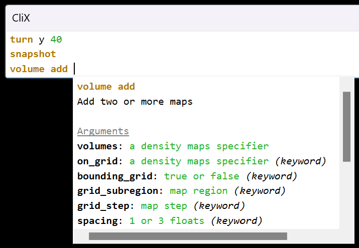
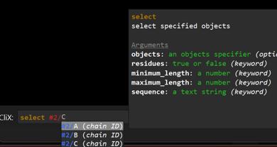
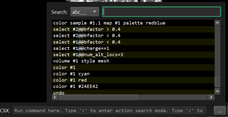
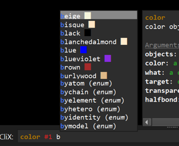
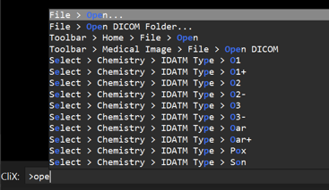
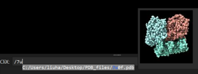

# CliX



An intelligent command line interface for ChimeraX.

## Features

|Thumbnail|Features|
|:-|:-|
||<ul><li>Syntax highlighting</li><li>Suggestions and completions (command, keyword, file path, color, model ID, chain ID and more)</li><li>Inline suggestion of the matched history</li><li>Tooltip for command help</li><li>Multi-line execution</li></ul>|
||Powerful history search|
||<ul><li>Color preview</li><li>Suggest built-in colors</li></ul>|
||Quick search for application actions|
||Quick search for the recent files|


## Installation

#### From toolshed

`clix` is available as a [toolshed bundle](https://cxtoolshed.rbvi.ucsf.edu/apps/chimeraxclix).
Go to `Tools > More Tools`, find `clix` and click `Install`.

#### From source

1. Get the source code.
   - Get the [latest release](https://github.com/hanjinliu/Chimerax-clix/releases) and unzip it.
   - or clone this repository.
      ```shell
      git clone git+https://github.com/hanjinliu/ChimeraX-clix
      ```
   - or manually download the contents from the "<> Code" pulldown menu in this page.

2. Install `clix` using ChimeraX built-in command line interface
   ```shell
   devel install "path/to/ChimeraX-clix"
   ```

## Start CliX

CliX widget is under `Tools > General > CliX`.

If you want to replace the built-in command line interface with `clix`, open
`Favorites > Settings...` and define a startup as follows:

```shell
ui tool hide "command line interface"
ui tool show clix
```

## Issues/Requests

If you find a bug, or have some feature requests, feel free to open an issue in this 
GitHub repository, or contact me via [X/Twitter](https://twitter.com/liu_hanjin) or
[bluesky](https://bsky.app/profile/liu-hanjin.bsky.social).
